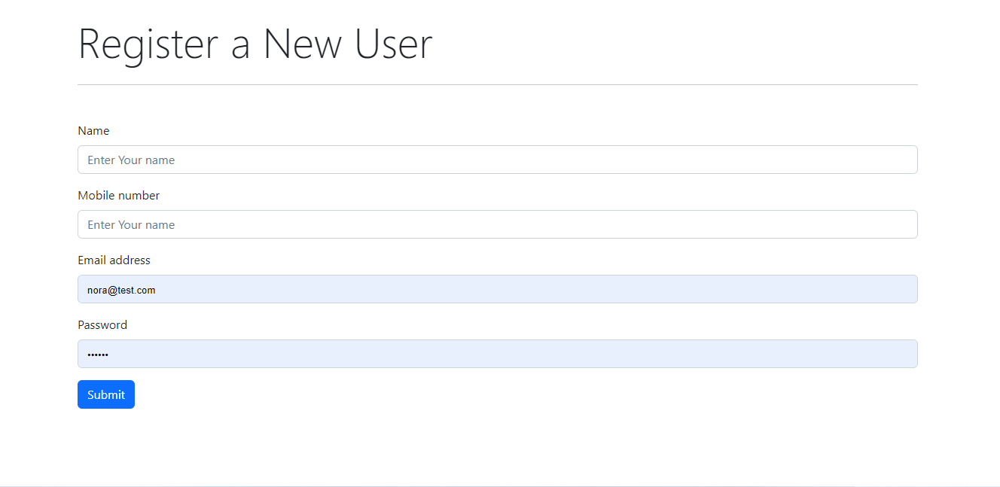
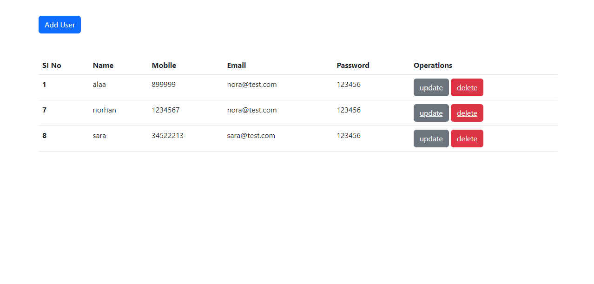

# Basic CRUD app using php programming language
using Xampp as web server and mysql server for the datebase
### In this app user can perform the following operations:

1. Register a new user information such as name, mobile, email and password into the datebase table
2. Update the user info
3. delete the user from the database

